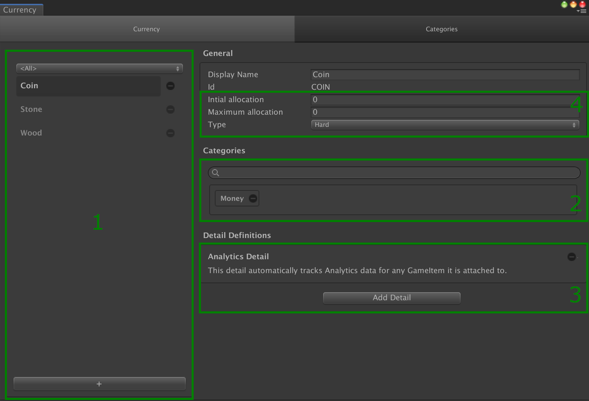

# Currencies

## Overview

A __Currency__ is a [catalog item] dedicated to the [Wallet Management].

This type of item has 3 special fields:

- `Initial allocation`: the balance the player has when his/her profile is created.
- The `maximum` balance a player can have.
  `0` means no limit.
- The type of the __currency__.

## Currency Type

A __Currency__ can be soft, or hard.

Also called "regular currency" or "free currency", a __soft__ currency is a resource designed to be adequately accessible through normal gameplay, without having to make micro-transactions.

A __hard__ currency is a resource that is exclusively, or near exclusively acquired by paying for it (real-money transactions).
Also called "premium currency", it is much harder to acquire without making purchases, and thus is considered to be premium game content.

## Editor Overview

As usual, you can find:

- (1) the list of objects (here currencies) on the left side.
- (2) the [category] widget
- (3) the [details] section

In addition you'll find the three special fields (`initial allocation`, `maximum allocation,` and `currency type`) visible just below the identifier and display name fields (4).

[catalog item]: ../../Catalog.md#Catalog&#32;Items

[wallet management]: ../GameSystems/WalletManager.md

[category]: ../Category.md

[details]: ../Details.md
