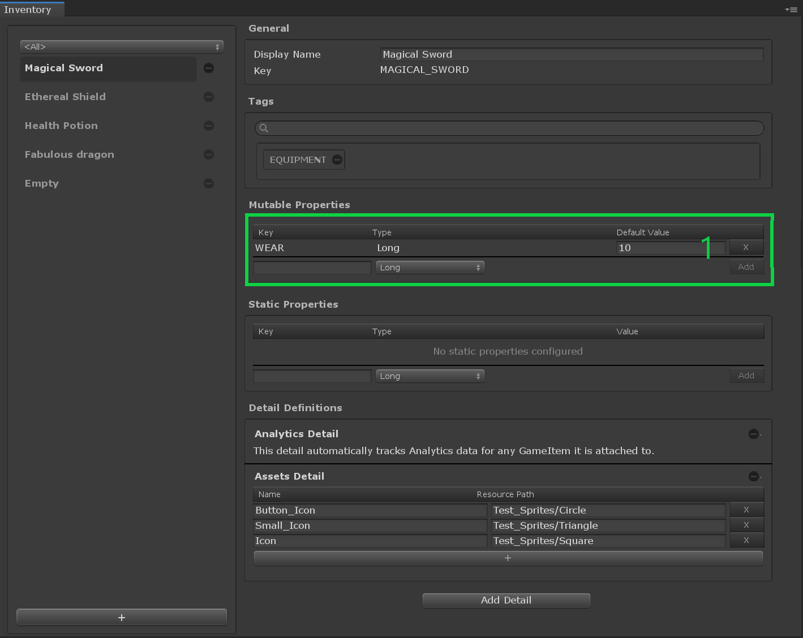

# Inventory Item Definitions

## Overview

An __Inventory Item Definition__ is a [catalog item] providing static data for your item instances.

It is the only item you can instantiate.

## Editor Overview

Open the __Inventory window__ by going to __Window → Game Foundation → Inventory__.
The Inventory window will let you configure inventory item definitions.

The window contains two tabs: Inventory tab and [Categories] tab.
To have more information about the [Categories] tab, please refer to [the dedicated page] of this documentation.

(1) On the left of the tab are listed the inventory item definitions.
Use the `+` button at the bottom to create a new one.

(2) The General section allows you to edit the Display Name of the item definition.
The ID is read-only. It can be set only at creation time.

(3) The [Categories] section is a widget which provides an intuitive way to assign [categories] to the edited item.  
Start typing your category, then select the proper one in the dynamically created list, or create a new one.

(4) The [details] section allows you to add custom static data to your item definition.
Refer to [this page of the documentation dedicated to details] for further information.

[catalog item]: ../Catalog.md#Catalog&#32;Items

[categories]:         ../Category.md
[the dedicated page]: ../Category.md

[details]:                                             ../Details.md
[this page of the documentation dedicated to details]: ../Details.md
