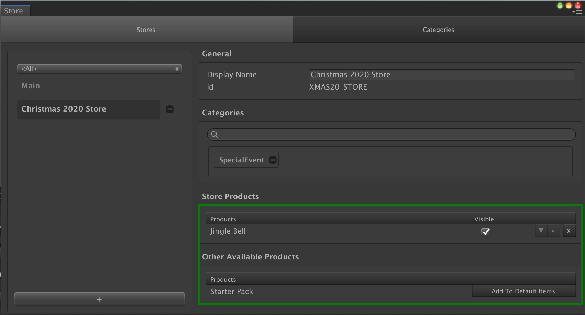

# Stores

## Overview

A __Store__ is a [catalog item] providing a subset of the [transaction catalog].

If your game uses multiple stores each with a different list of products, this [catalog item] is the one you'll use to create those lists.

You can use stores to display a different set of products depending on the situation of the player (their level, their location in the game, their behaviour, their character, ...)

A __Store__ contains a list of transaction objects ([Virtual Transactions] and [IAP Transactions]).

## Editor Overview

Open the __Store window__ by going to __Window → Game Foundation → Store__.
The Store window will let you configure Stores.

The main focus in this window is the Store Products section, which allows you to add and remove transaction objects to/from the product list.
The `Visible` checkbox next to the product is a way to avoid the transaction items from being added to the list of products at runtime, without having to remove it explicitely from the list.
In other words, it is a soft way to remove a product.

[catalog item]: ../Catalog.md#Catalog&#32;Items

[transaction catalog]: ../Catalog.md

[virtual transactions]: VirtualTransaction.md

[iap transactions]: IAPTransaction.md
