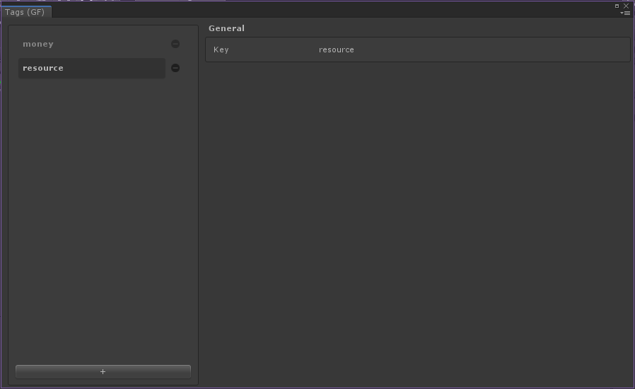

# Tags

## Overview

A __Tag__ provides a way to tag [catalog items].
There are many reasons to use __tags__.
You may want to regroup them and find all the items having a particular __tag__ using the [Inventory Manager], or enable a game feature for only items having a certain __tag__.
A [catalog item] can have as many __tags__ as needed.

It is identified by a string `id`.

## Editor Overview

The __Tags__ tab is visible for each type of [catalog item].

The layout is similar to the one for the [catalog items].

(1) The list of __tags__, with the possibility to add some with the `+` button at the bottom, and remove the existing ones with the `-` button next to the __tag__ entry.

(2) The general info with the identifier (`id`).

[catalog items]: ../Catalog.md#Catalog&#32;Items
[catalog item]:  ../Catalog.md#Catalog&#32;Items

[inventory manager]: ../GameSystems/InventoryManager.md
