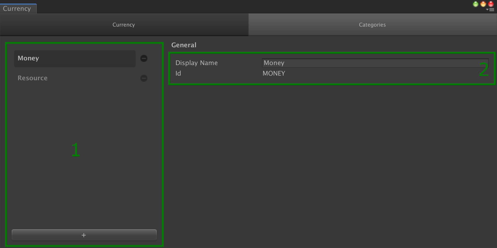

# Categories

## Overview

A __Category__ provides a way to tag [catalog items].
There are many reasons to use __categories__.
You may want to regroup them and find all the items having a particular __category__ using the [Inventory Manager], or enable a game feature for only items having a certain __category__.
A [catalog item] can have as many __categories__ as needed.

It is identified by a string `id`.
But it also has a `display name` that can be used as a more reader-friendly name when displayed in a UI.

## Editor Overview

The __Categories__ tab is visible for each type of [catalog item].

The layout is similar to the one for the [catalog items].

(1) The list of __categories__, with the possibility to add some with the `+` button at the bottom, and remove the existing ones with the `-` button next to the __category__ entry.

(2) The general info with the identifier (`id`) and the `display name`.

[catalog items]: Catalog.md#Catalog&#32;Items
[catalog item]:  Catalog.md#Catalog&#32;Items

[inventory manager]: GameSystems/InventoryManager.md
