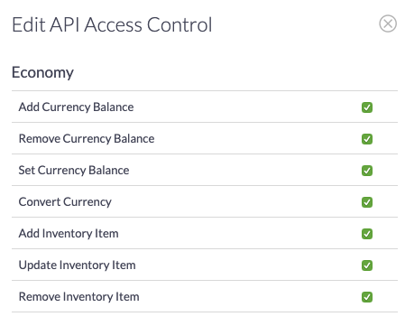
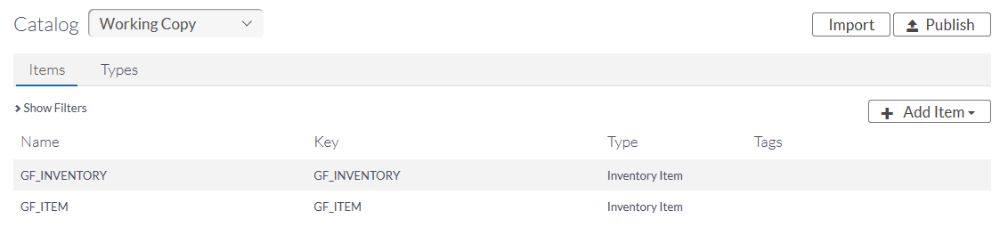
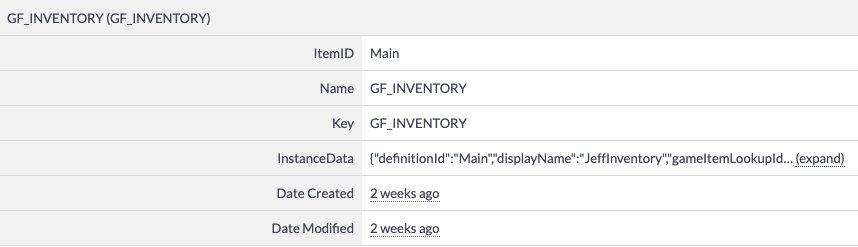
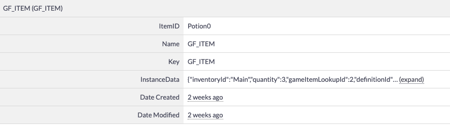

# ChilliConnectCloudSync

ChilliConnect is a multi-featured, connected, Live Game Management platform. It's available as an optional way to persist and view Game Foundation's data.

* [Getting started](#getting-started))
* [Setting up the API Access Controls](#setting-up-the-api-access-controls)
* [Creating ChilliConnect Item Types](#creating-chilliConnect-item-types)
* [Connecting Game Foundation to ChilliConnect](#connecting-game-foundation-to-chilliconnect)
* [Serializing in ChilliConnect](#serializing-in-chilliconnect)

## Getting started

1. You will need a ChilliConnect account to use ChilliConnectCloudSync with Game Foundation. If you don't have an account yet, you can [sign up here](https://www.chilliconnect.com/). 
2. After creating your account, you'll be asked to create your game in ChilliConnect: this creates your game token for connecting with ChilliConnect.  

You can find your **Game Token** on your ChilliConnect **Game** page.


## Setting up the API Access Controls

1. In your ChilliConnect **Game** page, select **API Access Controls** from the menu bar. 
2. In the **API Access Controls**, select **Edit API ACL**. This opens the **Edit API Access Control** window.
In the **Edit API Access Control** window, ensure that the last three items under **Economy** are checked: **Add Inventory Item**, **Update Inventory Item**, and **Remove Inventory Item**.   

   
3. Scroll to the bottom of the window and select **Update API Access Control** to save your changes.

## Creating ChilliConnect Item Types

You will need to create two **Items** in your ChilliConnect game: **GF_INVENTORY** and **GF_ITEM**.   
These identify **Inventory** objects and **InventoryItem**.

1. In your ChilliConnect **Game** page, select **Connect** and then **Catalog** from the icons on the left. 
2. In the **Catalog Items** window, open the **Add Inventory Item** window (menu: **Add Item → Inventory Item**). 
3. In the **Name** text box, type **"GF_INVENTORY"** and the select **Add Inventory Item** to save the new Item.
4. Repeat steps 2 and 3 to create a second item named **"GF_ITEM"**.  

   

5. After both items have been created, save them to your **Catalog** by selecting **Publish** at the top of the page.

## Connecting Game Foundation to ChilliConnect

1. In Game Foundation, create a script with the following parameters:

    ```
    using ChilliConnect;
    using UnityEngine.GameFoundation;
    ```

2. Use your **ChilliConnect Game Token** (found on your ChilliConnect **Game** page) in the script below. This logs you into ChilliConnect from your game. 
 
```    
public void Connect()
   {
       // Creates an SDK object
       var conn = new ChilliConnectSdk("<my-app-token>");
    
       // connects the player
       var credentials = new LogInUsingChilliConnectRequestDesc(
           "<chilliconnect-user-id>",
           "<chilliconnect-user-secret>" );
​
       // You can use the LogIn method of your choice.
       conn.PlayerAccounts.LogInUsingChilliConnect(
           credentials,
           (request, response) =>
           {
               // Initialize Game Foundation using the connection object.
               InitGameFoundation(conn);
           },
           (request, error) =>
           {
               Debug.Log("An error occurred while Login : " + error.ErrorDescription);
           });
   }
 
   void InitGameFoundation(ChilliConnectSdk conn)
   {
       // Creates a Cloud Sync adapter with the connection object.
       // Not that, in this state, the connection object IS connected.
       // This is not the responsibility of Game Foundation is validate
       // this object.
       var adapter = new ChilliConnectCloudSync(conn);
    
       // Initializes Game Foundation with the adapter.
       GameFoundation.Initialize(adapter);
   }
   ```

## Serializing in ChilliConnect


### Inventories 
Game Foundation inventories are stored in a ChilliConnect item with the following parameters:
* **ItemID** (Name of the inventory)
* **Name** (GF_INVENTORY) 
* **InstanceData**

**InstanceData** provides the following data:
* **definitionId**
* **DisplayName**
* **GameItemLookUp**

   

### Items 
Game Foundation items are stored in a ChilliConnect item with the following parameters:
* **ItemID** (Game Foundation item name)
* **Name(GF_ITEM)**
* **Instance Data**

**InstanceData** provides the following data:
* **inventoryId** (The name of the inventory this item is in)
* **Quantity**
* **GameItemLookUpId**
* **DefinitionId**

   
