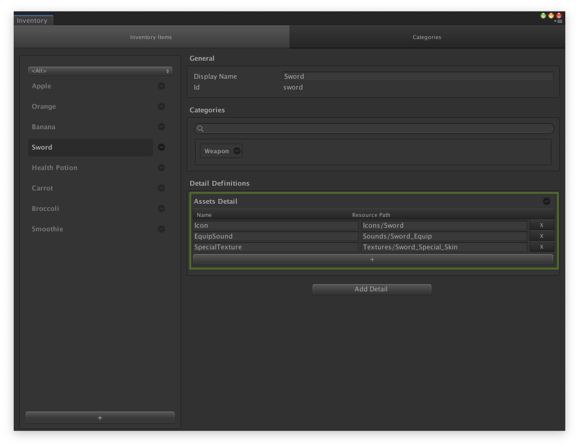

# Assets Detail

The __Assets Detail__ is used to store a list of [Resources] folder path of assets. All data stored in this detail are immutable, meaning that you can only read them at runtime.

The asset will be loaded from the [Resources] folder by Assets Detail when the assset is requested at runtime.



__Note:__ The [Resources] folder in Assets needs to be created, and all assets need to be in that folder before Assets Detail is used.

## Example

```cs
public class ExampleClass : MonoBehaviour
{
    public GameObject inventoryItemPrefab;
    
    void Start()
    {
        // Make sure GameFoundation is initialized. 
        if (GameFoundation.IsInitialized)
        {
            BuildInventory();
        }
        else
        {
            GameFoundation.Initialize(new MemoryDataLayer(), BuildInventory);
        }
    }

    void BuildInventory()
    {
        // Get all items from Inventory
        var items = new List<InventoryItem>();
        InventoryManager.GetItems(items);
        
        foreach (var item in items)
        {
            // Get Assets Detail
            var assetsDetail = item.definition.GetDetail<AssetsDetail>();
            
            // Create inventory item GameObject 
            var inventoryItem = Instantiate(inventoryItemPrefab);
            
            // Load icon sprite from Resources folder via Assets Detail
            var itemIcon = assetsDetail.GetAsset<Sprite>("Icon");
            
            // Set icon
            inventoryItem.GetComponent<Image>().sprite = itemIcon;
            
            // Load sound from Resources folder via Assets Detail
            var equipSound = assetsDetail.GetAsset<AudioClip>("EquipSound");
            
            // Set sound
            inventoryItem.GetComponent<AudioSource>().clip = equipSound;
            
            // Set display mame
            inventoryItem.GetComponent<Text>().text = item.definition.displayName;
        }
    }
}
```

[Resources]: https://docs.unity3d.com/ScriptReference/Resources.html