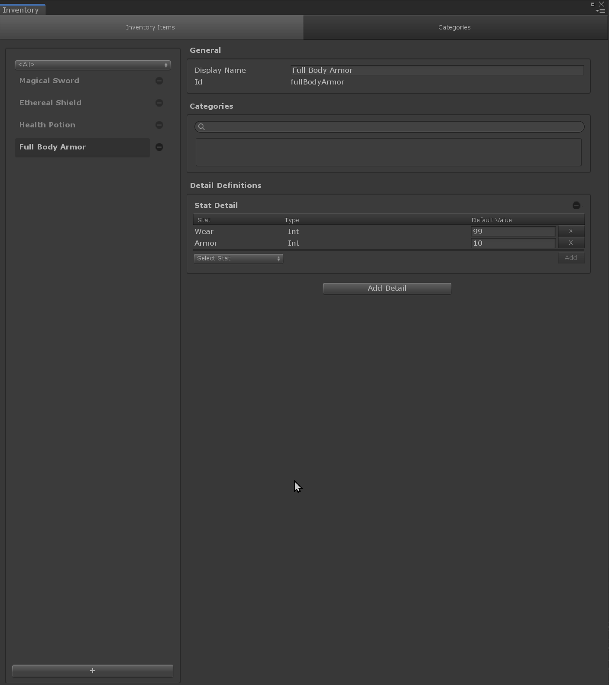

# Json Detail

The `JsonDetail` is made to store static data.
All data stored in this detail are immutable, meaning that you can only read them at runtime.

## Storable types

As this stores JSON data, it supports all [C# built-in types] as well as arrays of these types; except `System.Object`.

Custom types, and arrays of these, can also be stored if they respect specific conditions:
- The class isn't abstract.
- The class has a constructor taking no parameters (implicit if no other constructor is declared).
- The class implements the `IDictionaryConvertible` interface.\
Note: This interface is a contract to serialize/deserialize an object into/from a JSON-compatible dictionary.

## Example

We have a "Full Body Armor" in our inventory that already has some variable stats but we want to add static data to it.
Let's use a `JsonDetail`.



The `ArmorAura` class used in this example looks like this.

```cs
public class ArmorAura : IDictionaryConvertible
{
    public string Name { get; private set; }

    public string Description { get; private set; }

    public float IncreaseRate { get; private set; }

    public float Range { get; private set; }

    /// <summary>
    /// Converts this object to a JSON ready dictionary.
    /// </summary>
    public Dictionary<string, object> ToDictionary()
    {
        var jsonReadyDictionary = new Dictionary<string, object>
        {
            [nameof(Name)] = Name,
            [nameof(Description)] = Description,
            [nameof(IncreaseRate)] = IncreaseRate,
            [nameof(Range)] = Range
        };
        return jsonReadyDictionary;
    }

    /// <summary>
    /// Reset this object and fill it with the given data.
    /// </summary>
    /// <param name="rawDictionary">
    /// A dictionary containing JSON data.
    /// Note: Expect integer values (enum included) to be stored as <see cref="long"/>
    /// and floating values to be stored as <see cref="double"/>.
    /// </param>
    public void FillFromDictionary(Dictionary<string, object> rawDictionary)
    {
        //Reset values 
        Name = "";
        Description = "";
        IncreaseRate = 0;
        Range = 0;

        if (rawDictionary.TryGetValue(nameof(Name), out var rawName))
        {
            Name = rawName.ToString();
        }

        if (rawDictionary.TryGetValue(nameof(Description), out var rawDescription))
        {
            Description = rawDescription.ToString();
        }

        if (rawDictionary.TryGetValue(nameof(IncreaseRate), out var rawIncreaseRate))
        {
            IncreaseRate = Convert.ToSingle(rawIncreaseRate);
        }

        if (rawDictionary.TryGetValue(nameof(Range), out var rawRange))
        {
            Range = Convert.ToSingle(rawRange);
        }
    }
}
```

And here is an example of how you can get these data at runtime.

```cs
public class ArmorBehaviour : MonoBehaviour
{
    InventoryItem m_Armor;

    string m_Description;

    ArmorAura m_Aura;

    void Start()
    {
        //Make sure GameFoundation is initialized. 
        if (GameFoundation.IsInitialized)
        {
            GetArmorData();
        }
        else
        {
            GameFoundation.Initialize(new MemoryDataLayer(), GetArmorData);
        }
    }

    void GetArmorData()
    {
        //Find the armor item in the inventory.
        m_Armor = InventoryManager.FindItem("fullBodyArmor");

        //Get armor's static data.
        JsonDetail armorStaticData = m_Armor.definition.GetDetail<JsonDetail>();

        //Get armor's description.
        if (!armorStaticData.TryGetBuiltInData("description", out m_Description))
        {
            Debug.LogError("Couldn't find the armor's description.");
        }

        //Get armor's aura.
        if (!armorStaticData.TryGetCustomData("armorAura", out m_Aura))
        {
            Debug.LogError("Couldn't find the armor's aura data.");
        }
    }
}
```


[c# built-in types]: https://docs.microsoft.com/en-us/dotnet/csharp/language-reference/builtin-types/built-in-types