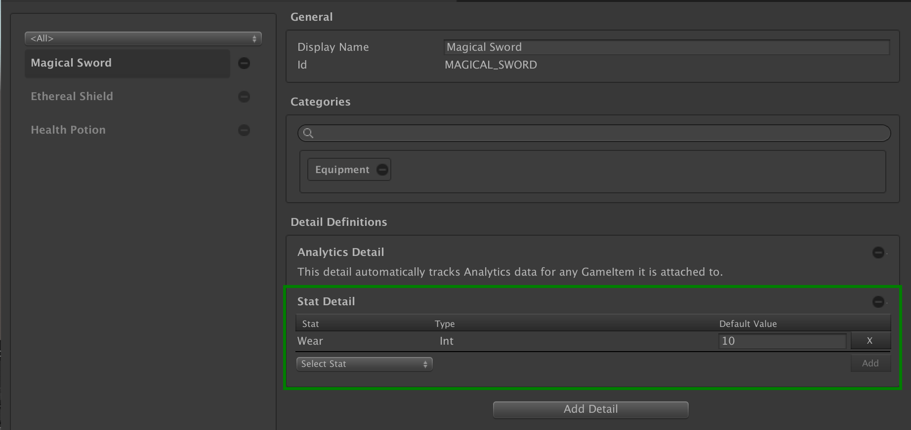

# Stat Detail

The __Stat Detail__ is used by  [Inventory Item Definitions] to define the list of mutable fields its item instance will expose.
Those mutable fields are defined by:

- A [Stat Definition].
- A default value.

The interface also provides buttons to add new fields, and to remove existing ones.

[inventory item definitions]: ../CatalogItems/InventoryItemDefinition.md

[stat definition]: ../StatDefinition.md
