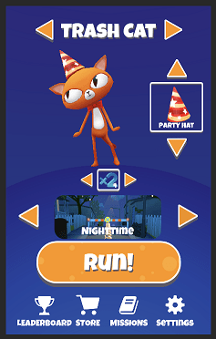
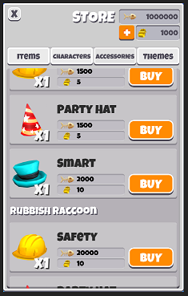

# Game systems

## Data access layer

The data access layer is responsible for providing Game Foundation-related game state data to the Game Foundation systems.
This makes it easy for you to switch between no persistence, local persistence, and your own persistence, without changing how your use GameFoundation.

We provide ready-to-use implementations that match the most common cases: 
* Use a `MemoryDataLayer` if you want to play from a clean slate each session (especially useful for testing).
You can also get Game Foundation's raw data from it to serialize them however you want.
* Use a `PersistenceDataLayer` to save and load your progression on a local file (see [Saving and loading the Game State](GFTutorial.md#Saving and loading the Game State) for a code sample).

You can also implement your own `IDataAccessLayer` if you have more specific requirements.

## Inventory

An inventory is a way of keeping track of a collection of items, as well as how many of those items exist in that collection. Some basic examples of inventories would be a backpack or a chest.

*Example: the main inventory contains characters, hats, bonuses, and themes.*

Inventories will have a **runtime instance** (inventories are collections which are Game Items) and a **definition**.
Game Foundation automatically creates a ‘main’ inventory by default, so you don’t need to define any inventories in advance.

## Wallet

The Wallet is a special kind of inventory which only contains currencies. A good  example for using the Wallet system is in casual mobile games where the player can accumulate one or more types of currency, such as coins, gems, etc. A default wallet is automatically created, and you can access and manage that default wallet conveniently with the Wallet class.

*Example: a player’s wallet, containing two types of in-game currency.*

## Stats

In Game Foundation, you can use Stats to track and manage any numeric values in your gameplay, such as the health of a character, damage points of a weapon, or how many times the player has beat a given level.
The numeric types currently supported are Float (C# System.Single) and Int (C# System.Int32). Once you choose which numeric type a stat is, it cannot be changed later. This restriction is in place to avoid conversion problems for values saved in players’ persisted data files.

## Analytics

This system lets you record game analytics without having to write code for data instrumentation, making it easy to analyze live game data to make data-informed decisions about your games. You can enable or disable both editor and runtime Analytics in the Game Foundation settings by adding or removing the Analytics Detail.

## ChilliConnectCloudSync

ChilliConnect is a multi-featured, connected, Live Game Management platform. It's available as an optional way to persist and view Game Foundation's data.

To learn how to get started with ChilliConnectCloudSync in Game Foundation, see [ChilliConnectCloudSync](ChilliConnect.md).

