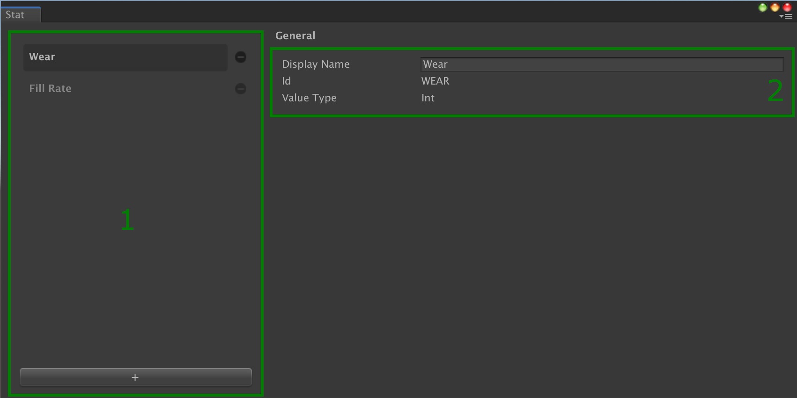
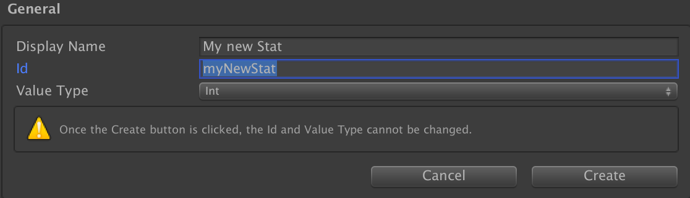

# Stat Definitions

# Overview

A __Stat Definition__ is the description of a mutable field.
It has a type (`integer` or `float` for Game Foundation 0.4), a unique identifier (`id`) and a `display name`.

__Stat Definitions__ are linked to the [Inventory Item Definitions], through the [StatDetail].
An item instance modifies its own stats based on the list of __Stat Definitions__ their [Inventory Item Definition] provides.

## Editor Overview

Open the Stat Window by going to `Window → Game Foundation → Stat`.
The Stat window will let you create __Stat Definitions__.

(1) On the left side of the panel, you can see the list of existing stats, with a `+` button  at the bottom to create a new one.

(2) The General section gives you the `id`, the `display name` and the `type` of the stat.
Most of this information stays read-only after the creation before the consequence of modifying them afterwards would be counter intuitive.

### Creating a new stat.

By clicking on the `+` button, the General section displays editable versions of the `id`, `display name` and `type` fields.

[inventory item definitions]: CatalogItems/InventoryItemDefinition.md
[inventory item definition]:  CatalogItems/InventoryItemDefinition.md

[statdetail]: Details/StatDetail.md
