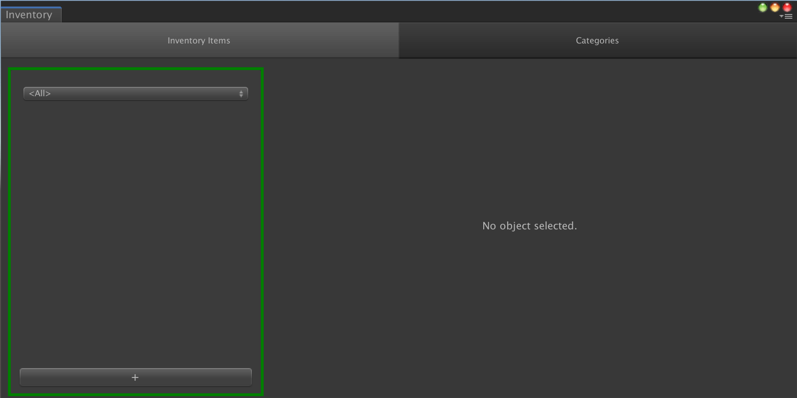
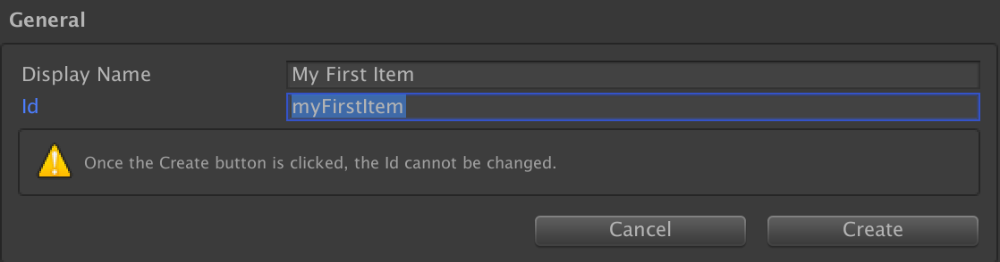
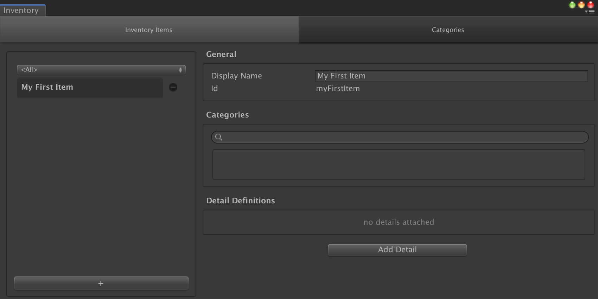
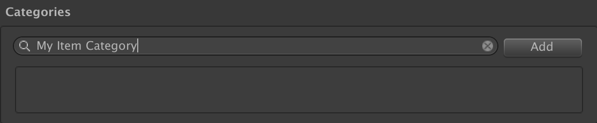
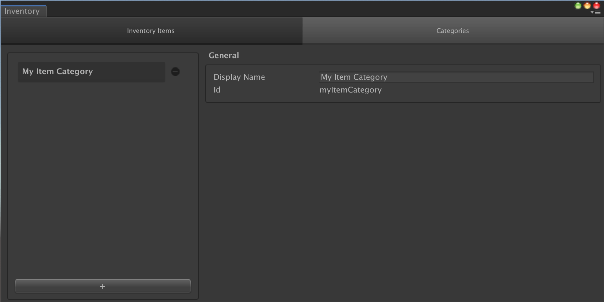

# Game Foundation Tutorials

## Creating an Inventory Item Definition

You may want to create items for your game, that the user can collect, create, trade, use, etc.
In Game Foundation, items are instances created from an [Inventory Item Definition].
This [definition] contains all the static data the instance can refer to, as a description of its type.

### Open the Inventory Window

In order to create an [Inventory Item Definition], you need to open the Inventory Window.
Open the Inventory Window by selecting __Window → Game Foundation → Inventory__.  
You may see the following window.

The window contains two tabs: _Inventory Items_, and _Categories_.
Let's focus on the _Inventory Items_ tab first.

The layout shows the first section, on the left (emphasised with a green box in the screenshot).
This section shows the list of [definitions] you've already created.
For the moment, you have none, so let's create one.

### Create a new item definition

At the bottom of this section, you can see a large `+` button.
It's the one you'll click on to start creating a new [definition].
Click on it now.

The right side of the layout is now updated and shows a simple form.

You can focus on giving your definition a `display name`.
The UI will convert this `display name` into an `id` automatically.
Of course, you can also choose to define your own `id`.  

> This display name is used by the editor itself, but you can use it inside your game too.

When done, click on the `Create` button on the bottom right-hand corner of the section.

### Configure your item definition

With the item "My First Item" selected on the left, you now can see the full configuration form displayed on the right-hand side of the window.

You still have the possibility to modify the `display name` of the [item definition], but the `id` is now read-only.

You now can see two additional sections below the General section: _Categories_ and _Detail Definitions_.

### Attach a category to your item definition

The _Categories_ section is an intuitive widget to link the selection [definition] to a [category].

You can type a [category] name directly in the search field.  
If categories already exist, a list will appear, showing [categories] matching with the characters you've already typed.
If the category you've typed doesn't exist, you can click the `Add` button to create the [category] and assign it to the [definition] right away.

You can also unassign a [category] by clicking on the the `-` button next to the it.

### The Categories tab

The _Categories_ tab is a categories manager.
It allows you to modify the `display name` of a [category], but also create and remove categories, in a similar way that you create and remove an [item definition].

Go to [the next tutorial] to see what we can do with this [item definitions].

[stat tutorial]: 0x-PlayingWithStats.png

[inventory item definition]: ../CatalogItems/InventoryItemDefinition.md "Go to Inventory Item Definition"
[definition]:                ../CatalogItems/InventoryItemDefinition.md "Go to Inventory Item Definition"
[definitions]:               ../CatalogItems/InventoryItemDefinition.md "Go to Inventory Item Definition"

[item definition]:  ../CatalogItems/InventoryItemDefinition.md "Go to Inventory Item Definition"
[item definitions]: ../CatalogItems/InventoryItemDefinition.md "Go to Inventory Item Definition"

[category]:   ../Category.md
[categories]: ../Category.md

[detail]:  ../Details.md
[details]: ../Details.md

[stat detail]: ../Details/StatDetail.md

[stat definition]: ../StatDefinition.md

[the next tutorial]: 02-PlayingWithRuntimeItem.md