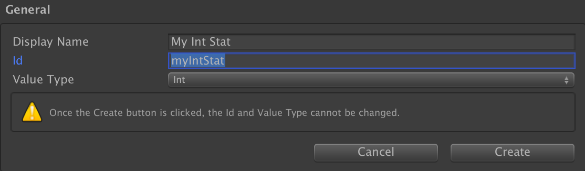
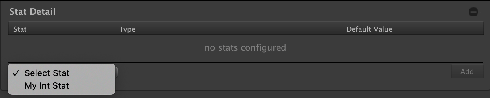
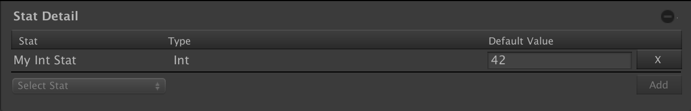

# Game Foundation Tutorials

## Adding mutable properties with Stats

With the [Json Detail], we've seen [how to add static properties] to enhance the [item definition].
This system wouldn't be complete without a solution to play with mutable data at the instance level.
A piece of equipment can wear down, a character can level up, ammunition can decrease, ... those properties are mutable.

To solve this aspect, Game Foundation features a [Stat System].
This system involves three components:

1. the [StatDetail]
2. some [Stat Definitions]
3. the [Stat Manager]

We'll see in this tutorial how to define the first two, and [the following tutorial] will focus on using Stat Manager to play with them at runtime.

> [Details] are static data... the [StatDetail] is also a static configuration, but it defines with stat the instance will expose as mutable properties.

### Create a Stat Definition

We need first to create a [Stat Definition].
This is a named property, with a type (currently only `int` and `float` are supported).

To create a [Stat Definition], open the __Stat Window__ by selecting __Window → Game Foundation → Stat__

The layout should now look familiar.
Otherwise please check the [inventory tutorial].

We'll focus here on the creation form, which shows a specific parameter.

The `Value type` is the type of this stat.
Every [catalog item] using this stat will expose the same property, with the same type.

Create your Stat Definition according to the screenshot above.

- `Display Name`: `"My Int Stat"`
- `Id`: `"myIntStat"` (let the system fill this field for you)
- `Value type`: choose `Int`

### Adding the Stat Detail to an item definition

We've seen in [the previous tutorial] how to attach [details] to a [catalog item].

Please follow the same steps to add the [Stat Detail] to our [item definition].

### Adding a Stat to the Stat Detail

The [Stat Detail] section show the list of the [stats] and their default value.  
At the bottom of the section, you can see a popup list and an `Add` at the opposite side.

Select the stat you've just created (`"My Int Stat"`), then click on `Add`.

Now that the [stat] is added, you can define a default value (we've put `42`).
That means when the item instance is created from this [item definition], the value of its `"My Int Stat"` will be `42`.

### Conclusion

We can now configure an [item definition] with mutable properties.
[The next step] is to manipulate this mutable property at runtime.

[json detail]: ../Details/JsonDetail.md

[how to add static properties]: 06-AddStaticPropertiesWithDetails.md
[the previous tutorial]:        06-AddStaticPropertiesWithDetails.md

[item definition]: ../CatalogItems/InventoryItemDefinition.md

[stat system]:  ../GameSystems/StatManager.md
[stat manager]: ../GameSystems/StatManager.md

[statdetail]:  ../Details/StatDetail.md
[stat detail]: ../Details/StatDetail.md

[stat definitions]: ../StatDefinition.md
[stat definition]:  ../StatDefinition.md
[stat]:             ../StatDefinition.md

[the following tutorial]: 08-PlayingWithStats.md
[the next step]:          08-PlayingWithStats.md

[details]: ../Details.md

[catalog item]: ../Catalog.md#Catalog&#32;Items

[inventory tutorial]: 01-CreateAnItemDefinition.md
