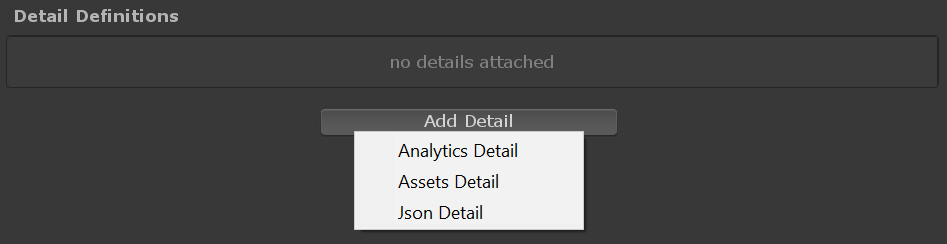
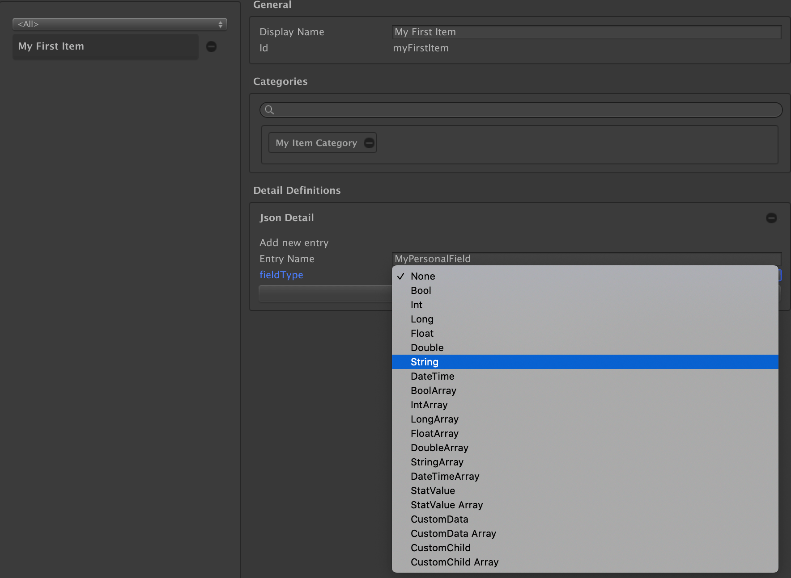

# Game Foundation Tutorials

## Adding static data with details

As we've seen in the [previous tutorial], **Static Properties** allows you to store custom data for your catalog item definitions. 

In this tutorial, we'll cover another way to add data to your catalog items: using **Details**.
Details allows you to add sets of static data to an item definition, using pre-defined data blocks, that is a bit similar to attaching `Components` to `GameObject`, the same composition style you are used to in Unity environment. 

Details only contain data and doesn't include logic implementation. In some cases, a Detail we provide is associated with certain built-in functionality in Game Foundationthe logic for such functionality is implemented separately. Analytics Detail is an example of that. 

Next we'll cover how you can attach Details to your catalog item definition. 

### Creating Details

> In this tutorial step, we'll add details to our [item definition], but keep in mind that you can add details to any [catalog items] ([currencies], [virtual transactions], [IAP transactions], [stores]).

Adding details to an [item definition] is done in the __Inventory Window__.
Open this window (__Window → Game Foundation → Inventory__)

The _Detail Definitions_ section contains the details of the [item definition].

> Details are blocks of static data you can add to a definition in order to enrich it.

A couple of details are available in Game Foundation.
You can see the list of details if you click on the `Add Detail` button.



The available details are:

- Analytics Detail: used for Analytics
- [Assets Detail]: to links assets with your items.
- [Json Detail]: to add personalized static data fields.


For this tutorial, we'll focus on the most flexible one: the [Json Detail].

Click on the `Add Detail` button, then select [Json Detail].

### Adding a custom field to the the Json Detail

Now that a [Json Detail] is added to the [item definition], we can add custom fields to it.
The [Json detail] always shows the field creation form.
You have two fields to fill:

- the `entry name` is the name of the field.
  We'll use this name to access the value in the code.
- the `type` of the field.
  You can see the list of all the supported types in the screenshot above.



Create the `MyPersonalField` field, of type `String`.  
Then click on the large `+` button at the bottom of the field creation section.
It adds the field to the detail.


You now can define a value for your field.
This is a static value.
You won't be able to change it.

Write "Lorem Ipsum Dolot Sirt Amet".

### Getting the details at runtime

Let's switch to the coding part now.  
As a prerequisite step, please make sure you've followed the [steps for getting an item definition found in the inventory tutorial].

In your `OnInitSucceeded` method, replace the code below the `null`-check of the `definition` variable, and append the following code:

```cs
var definition = catalog.FindItem(definitionId);

if (definition is null)
{
    Debug.Log($"Definition {definitionId} not found");
    return;
}

// Insert your code here

// Retrieving the detail by its type.
var detail = definition.GetDetail<JsonDetail>();

// If the item hasn't had a json detail added in the inventory
// window, this will return null.
if (detail is null)
{
    Debug.LogError($"Detail {nameof(JsonDetail)} not found in '{definition.displayName}'");
    return;
}

Debug.Log($"Detail {detail.GetType().Name} found");
```

Compile and start your scene.
You should see a new log entry:

```
! Detail JsonDetail found
```

Now than you have a reference to your detail, you can use the specific API of this detail to get info.  
For the [Json detail], you can use the `TryGetBuiltInData<>` method.  
Append the following code to the `OnInitSucceeded` method.

```cs
const string fieldName = "MyPersonalField";

var found = detail.TryGetBuiltInData<string>(fieldName, out var message);
if (!found)
{
    Debug.LogError($"{fieldName} not found");
    return;
}

Debug.Log($"Message found: {message}");
```

Compile and start your scene.
You should see a new log entry:

```
! Message found: Lorem Ipsum Dolor Sit Amet
```

### Conclusion

A full description of the [Json Detail] is available in its dedicated page.

What if I would like to add data that can be modified within an item instance?
We'll see that in the [next tutorial].


[previous tutorial]: 06-StaticProperties.md

[catalog items]: ../Catalog.md#catalog-items

[inventory item definition]: ../CatalogItems/InventoryItemDefinition.md
[item definition]:           ../CatalogItems/InventoryItemDefinition.md

[currencies]: ../CatalogItems/Currency.md

[virtual transactions]: ../CatalogItems/VirtualTransaction.md

[iap transactions]: ../CatalogItems/IAPTransaction.md

[stores]: ../CatalogItems/Store.md

[assets detail]: ../Details/AssetsDetail.md

[json detail]: ../Details/JsonDetail.md

[mutable data fields]: 08-MutablePropertiesEditor.md
[next tutorial]:       08-MutablePropertiesEditor.md

[steps for getting an item definition found in the inventory tutorial]: 02-PlayingWithRuntimeItem.md#getting-the-inventory-item-definition-at-runtime
