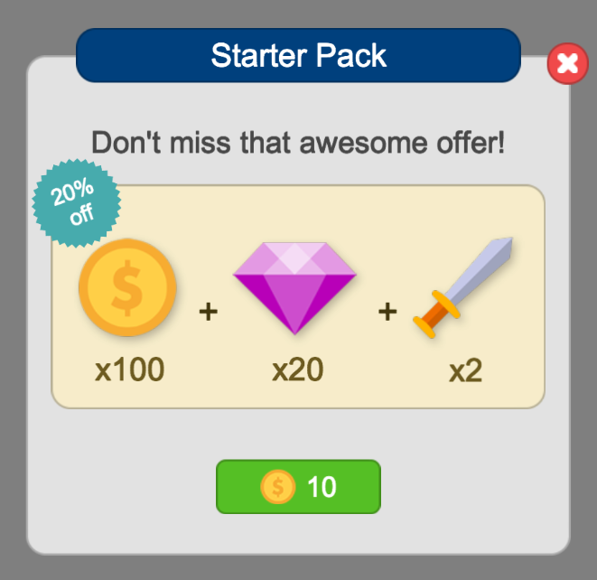
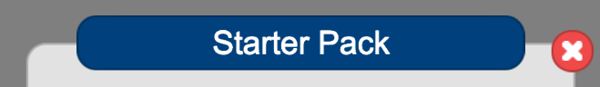
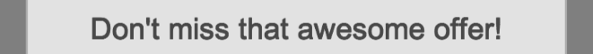
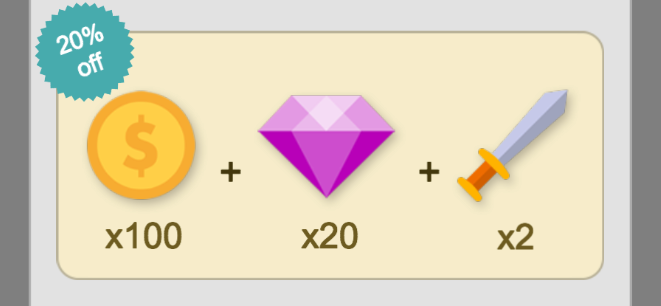
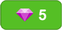

# Game Foundation Tutorials

## Working with Promotion Pop Up prefab

This tutorial will show how to use the Promotion Popup prefab and component to advertise a transaction that you would like to display as a special offer, like a starter pack, for example.

The image above shows the prefab displaying a sample starter pack promotion.
The prefab has two options for the main promotion image: to display an image you supply, or to auto-generate one based on the rewards in the transaction.
This sample starter pack is using an auto generated image.

The promotion prefab is designed to be flexible, allowing you to swap in your own images and layouts to make the pop up look like one that is native to your game.
However, the component supplied with the prefab could also be attached to a prefab of your own design, and would handle getting the images and data to display from the transaction for you.

### Finding the prefab and component

The provided prefabs are located in the Game Foundation package inside the `UI/Prefabs/Store/Promotion` folder.
The components that are used by these prefabs (or available to be used by your own custom prefabs) are also located in the Game Foundation package inside the `UI/Runtime` folder.

### Breaking down the prefab and component

#### Header

Ther header of the prefab has popup title and close button. 
The popup title is filled in using the display name of the selected transaction.
The text field where you want the name to be filled in is linked to the component in the `Title Text` in GameObject Fields section.

Also in the header of the prefab is the close button.
This can be reskinned to look however you would like in your game.
By default it is linked to the component's `Close` method, which sets the prefab's active state to false, and triggers the `popupClosed` callback.

#### Description

To set the text that you want to be displayed in the promotion description, you'll define static property `key` and `string value` for the transaction you want to display in the promotion.
You can use whatever key you want (the default one the prefab looks for is 'promotion_description').
If you decide to change the key from the default one, you will need to tell the component what key to look for in the `Description Property Key` component field.

The text field where you want the name to be filled in is linked to the component in the `Description Text` in GameObject Fields section.

#### Promotion Pack Image

The promotion pack image section of the prefab is made up of two parts, the promotion image area and the badge.

##### Badge

The badge can be used to include a special callout about the promotion.
The text for the badge is specified in the transaction's static property, just like the promotion description.
The default key for the badge is 'promotion_badge'.

The text field where you want the name to be filled in is linked to the component in the `Badge Text` in GameObject Fields section.

##### Promotion Image Area

The promotion image area is where the image that showcases all the benefits the user will get from purchasing goes.
There are two options for filling this image in: by supplying the image yourself, or by letting the prefab auto generate an image for you.

If you want to supply the image yourself:
- Uncheck `Generate Promo Image` in the Promotion Popup component
- Add the image to the transaction's Asset detail, using the name suggested by the component ('promotion_image'), or your own
- Set the `Promo Image Sprite Name` field in the component to match the name used in the previous step
The GameObject where you want the image displayed should be set in the `Promotion Image` in GameObject Fields section.

If you want to have the prefab auto generate the image for you:
- Check `Generate Promo Image` in the Promotion Popup component
- Make sure each item or currency added as a reward in the transaction have an image added in their Asset detail, using the same name (by default the component looks for 'promotion_icon')
- Set the `Reward Item Icon Sprite Name` to the name used in the previous step
- Specify whether you want a prefix for when the image displays the count of each item, if this field is left blank, no prefix will be used
- Specify whether you want a prefix for when the image displays the count of each currency, if this field is left blank, no prefix will be used

The GameObject where you want the image generated should be set in the `Auto-Generated Image Contanier` in GameObject Fields section.

Additionally, a very basic Reward Item prefab is also included, to be used with the Promotion Popup prefab when auto generating the promotion image.
This prefab just arranges the reward image and count for easy adding of duplicates.

#### Purchase Button

The Promotion Popup uses the Purchase Button prefab also used by the Store prefabs and first described in the [Working with Store Prefabs tutorial].
The Promotion Popup component also has a field for specifying what name to use for looking up the cost image to display on the purchase button, if the cost is a virtual currency or item.
By default the component looks for the name 'purchase_button_icon' but you can set it to any other string you prefer.

In case you want to use your own Purchase Button, you can change what prefab to use in the Purchase Button field of the component (whichever prefab you set, it must have the PurchaseButton component attached).

By default, the prefab is configured to call the component's close method if the Purchase Button OnTransactionSucceeded callback is triggered (i.e. the prefab will close automatically after a successful purchase).
Should you want a different behavior after a successful purchase, you can remove the Close method from the list of On Transaction Succeeded listeners.

### Working with the Promotion Popup Component API

The main ways you'll interact with the Promotion Popup component's API is in calling the open and close methods.

Additionally, there are setter methods for changing any of the fields on the component.
These can be used to change how the prefab is displayed at runtime, including which transaction is displayed.

Finally there is a host of callbacks you may want to subscribe to for knowing when the popup is about to open or close, has just finished opening or closing, or whether a purchase has successfully completed, or attempted to be completed and failed.

### Conclusion

We hope this prefab will help to provide a simple and easy way for adding a promotion to your game.

[Working with Store Prefabs tutorial]: 14-WorkingWithStorePrefabs.md#purchase-button-component